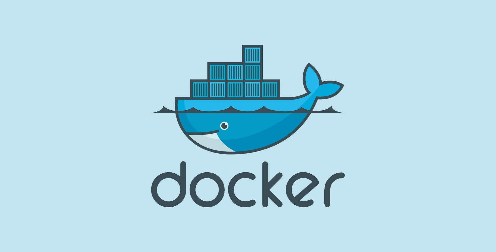
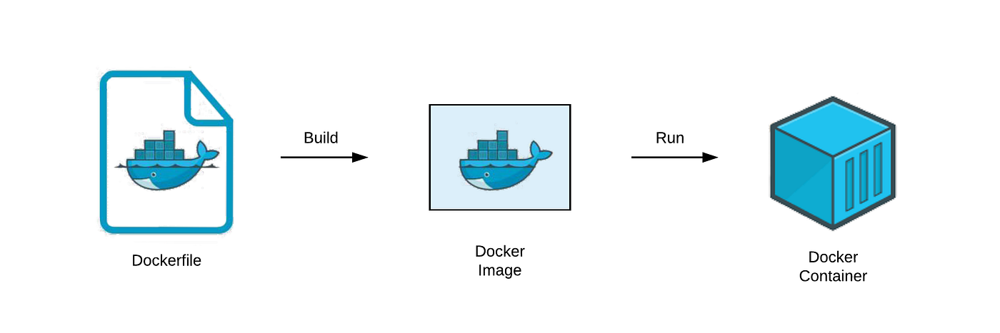

# Introduction to Docker

## Overview

**Docker** is a containerization platform that allows applications to be **packaged with their dependencies and runtime environment into isolated units called containers**.  

These containers run consistently across different environments—development, testing, staging, and production—eliminating issues caused by environment mismatches.



---

## Why Docker Exists

Before Docker, backend applications often failed when moved between environments due to:

- different operating systems
- mismatched library versions
- inconsistent runtime configurations
- manual environment setup

This led to the classic problem: *“It works on my machine.”*

Docker solves this by allowing developers to **define the application environment once and run it anywhere**.

---

## What Docker Does

Docker enables you to:

- package an application and its dependencies together
- run applications in isolated containers
- standardize environments across teams
- deploy services consistently
- scale applications efficiently

Containers created using Docker behave the same regardless of where they run.

---

## Core Docker Concepts



---

### Dockerfile

A **Dockerfile** is a text file that contains instructions to build a Docker image.

Example:
```dockerfile
FROM openjdk:17
COPY app.jar app.jar
CMD ["java", "-jar", "app.jar"]
```

---

### Docker Image

A **Docker image** is a read-only blueprint that defines:
- application code
- runtime
- libraries
- environment configuration

Images are used to create containers.

---

### Docker Container

A **Docker container** is a running instance of a Docker image.  
It is isolated, reproducible, and disposable.

---


### Docker Engine

The **Docker Engine** is the runtime that:

* builds images
* runs containers
* manages networking and storage

---

## Real-World Example

A Spring Boot backend service:

* runs locally on Docker
* runs same image in CI
* deployed unchanged to staging and production

No environment-specific surprises.

---

## Summary

* Docker packages applications into lightweight containers

* Containers run consistently across environments

* Docker images define container structure

* Containers are faster and lighter than virtual machines

* Docker is foundational for modern backend and cloud-native systems

---