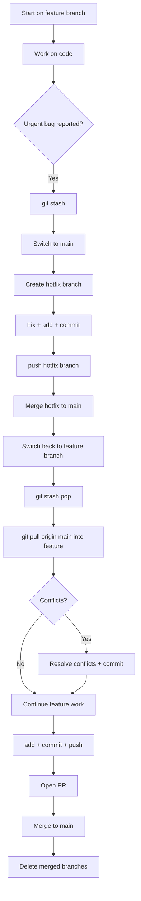
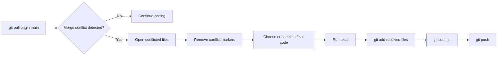

# Real World End-to-End Git Workflow Scenario

## Overview

In real backend teams, Git workflows are not just `add -> commit -> push`.
A normal day often includes:

- pulling latest changes from `main`
- creating a feature branch
- stashing urgent in-progress work
- fixing a production bug
- pushing multiple branches
- resolving merge conflicts
- opening and merging a Pull Request

This guide simulates a realistic day for a backend engineer and covers all important commands in one continuous scenario.

---

## Scenario Setup

You are working on an e-commerce backend service.

Current branches:

- `main` (production baseline)
- `develop` (integration branch)
- your feature branch will be `feature/coupon-validation`

An urgent production issue appears while your feature work is still unfinished.

You must:

1. save current feature work safely
2. switch context to bug fix
3. fix and push hotfix
4. return to feature work
5. sync with remote updates
6. resolve conflicts
7. complete and merge the feature

---

## High-Level Workflow Diagram



---

## Detailed Step-by-Step Execution

### 1. Start from latest `main`

```bash
git switch main
git pull origin main
```

Why:

- ensures local `main` is current
- avoids creating branches from stale commits

---

### 2. Create and switch to feature branch

```bash
git switch -c feature/coupon-validation
```

Do your implementation changes in service/controller/validation files.

Check progress:

```bash
git status
git diff
```

---

### 3. Stage and commit meaningful checkpoints

```bash
git add src/coupon/CouponValidator.java src/coupon/CouponController.java
git commit -m "feat(coupon): add validation for expiration and user eligibility"
```

Continue work, then create another commit:

```bash
git add .
git commit -m "test(coupon): add integration tests for coupon validation rules"
```

Push feature branch:

```bash
git push -u origin feature/coupon-validation
```

---

### 4. Urgent production bug appears while coding

You have uncommitted local work now.

```bash
git status
```

Temporarily save it:

```bash
git stash push -m "WIP coupon refactor before urgent hotfix"
```

Verify stash:

```bash
git stash list
```

---

### 5. Create hotfix branch from `main`

```bash
git switch main
git pull origin main
git switch -c hotfix/payment-timeout-null-check
```

Implement bug fix, then:

```bash
git add src/payment/PaymentService.java
git commit -m "fix(payment): add null guard for timeout configuration"
git push -u origin hotfix/payment-timeout-null-check
```

---

### 6. Merge hotfix through Pull Request (team flow)

Typical team flow:

1. open PR: `hotfix/payment-timeout-null-check` -> `main`
2. CI passes
3. reviewer approves
4. merge PR

After merge, sync local `main`:

```bash
git switch main
git pull origin main
```

---

### 7. Return to feature and restore stashed work

```bash
git switch feature/coupon-validation
git stash pop
```

If there are conflicts during stash pop, resolve and then:

```bash
git add .
git commit -m "chore: resolve conflicts after restoring stashed coupon work"
```

---

### 8. Bring latest `main` changes into feature branch

Use merge-based sync:

```bash
git pull origin main
```

Alternative explicit merge:

```bash
git fetch origin
git merge origin/main
```

If conflict occurs, Git marks conflict regions.
Resolve manually, then:

```bash
git add .
git commit -m "merge: resolve conflicts with latest main before PR"
```

Push updated feature branch:

```bash
git push
```

---

### Merge Conflict Resolution Diagram



---

### 9. Finalize feature and push

```bash
git add .
git commit -m "feat(coupon): complete coupon validation and edge-case handling"
git push
```

Open PR: `feature/coupon-validation` -> `main`

After approval and CI success, merge the PR.

---

### 10. Post-merge cleanup

Update local branches:

```bash
git switch main
git pull origin main
```

Delete local merged branches:

```bash
git branch -d feature/coupon-validation
git branch -d hotfix/payment-timeout-null-check
```

Delete remote branches:

```bash
git push origin --delete feature/coupon-validation
git push origin --delete hotfix/payment-timeout-null-check
```

---

## End-to-End Command Timeline (Quick Reference)

```bash
# start clean
git switch main
git pull origin main

# feature work
git switch -c feature/coupon-validation
git add .
git commit -m "feat: initial coupon validation"
git push -u origin feature/coupon-validation

# urgent interruption
git stash push -m "WIP before hotfix"
git switch main
git pull origin main
git switch -c hotfix/payment-timeout-null-check
git add .
git commit -m "fix: payment timeout null guard"
git push -u origin hotfix/payment-timeout-null-check

# assume PR merged

git switch main
git pull origin main

# resume feature
git switch feature/coupon-validation
git stash pop
git pull origin main
# resolve conflicts if needed

git add .
git commit -m "feat: finalize coupon workflow"
git push

# merge PR then cleanup
git switch main
git pull origin main
git branch -d feature/coupon-validation
git push origin --delete feature/coupon-validation
```

---

## Common Mistakes and How to Avoid Them

1. Stashing and forgetting it forever
Use `git stash list` regularly and clear old entries.

2. Committing on `main` by mistake
Use branch protection and verify with `git branch` before commit.

3. Pushing without pulling latest changes
Make `git pull origin main` a habit before branch creation.

4. Using `git push --force` on shared branches
Avoid force push on `main` and protected branches.

---

## Summary

This real-world workflow demonstrated how to move safely through:

- feature development
- urgent interruption handling with stash
- hotfix creation and merge
- synchronization with remote changes
- conflict resolution
- final PR merge and cleanup

If you can execute this scenario confidently, you are ready for practical Git usage in most backend engineering teams.

---
