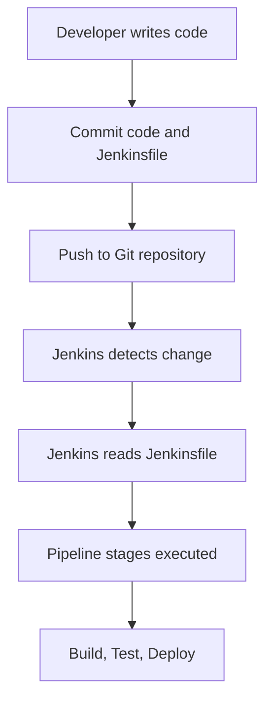
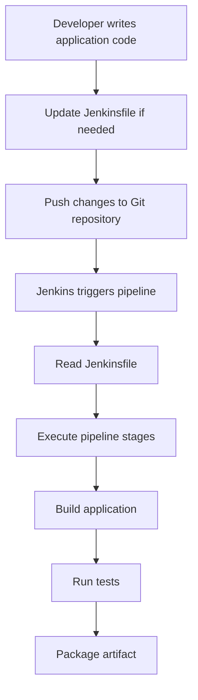

# Pipeline as Code

## Overview

**Pipeline as Code** is the practice of defining CI/CD pipelines using code stored in the source repository instead of configuring them manually through a graphical interface.

In Jenkins, pipelines are typically defined using a **Jenkinsfile**, which describes the stages, steps, and behavior of the build pipeline.

This approach allows teams to treat pipelines the same way they treat application code — **version-controlled, reviewable, and reproducible**.

---

## Why Pipeline as Code Is Important

Earlier CI/CD systems relied heavily on **manual configuration through UI dashboards**.

This created several problems:

* pipeline configurations were not version-controlled
* changes were difficult to track
* pipelines could break without clear history
* environments were harder to reproduce

Pipeline as Code solves these problems by storing pipeline definitions directly in the **code repository**.

Benefits include:

* version control for pipelines
* reproducible builds
* easier collaboration
* consistent automation across environments

---

## How Pipeline as Code Works

With Pipeline as Code, the pipeline definition lives inside the project repository.

When code changes are pushed:

1. Jenkins pulls the repository
2. Jenkins reads the `Jenkinsfile`
3. The pipeline defined in the file is executed

Typical workflow:



This ensures the pipeline is **automatically executed based on the version-controlled configuration**.

---

## Jenkinsfile

A **Jenkinsfile** is a script that defines the CI/CD pipeline.

It is written using **Groovy-based syntax** and stored in the root of the repository.

Example structure:

```text
project-repository/
 ├── src/
 ├── tests/
 ├── Dockerfile
 └── Jenkinsfile
```

When Jenkins runs the pipeline, it reads the instructions from this file.

---

## Types of Jenkins Pipelines

Jenkins supports two types of pipeline definitions.

| Pipeline Type        | Description                  |
| -------------------- | ---------------------------- |
| Declarative Pipeline | Structured and easier syntax |
| Scripted Pipeline    | More flexible but complex    |

Declarative pipelines are most commonly used in modern Jenkins setups.

---

## Declarative Pipeline Example

Example Jenkinsfile using declarative syntax:

```groovy
pipeline {
    agent any

    stages {
        stage('Checkout') {
            steps {
                git 'https://github.com/example/project.git'
            }
        }

        stage('Build') {
            steps {
                sh 'npm install'
            }
        }

        stage('Test') {
            steps {
                sh 'npm test'
            }
        }
    }
}
```

Each stage defines a part of the CI/CD workflow.

---

## Scripted Pipeline Example

Scripted pipelines provide more flexibility but require deeper Groovy knowledge.

Example:

```groovy
node {
    stage('Checkout') {
        git 'https://github.com/example/project.git'
    }

    stage('Build') {
        sh 'mvn compile'
    }

    stage('Test') {
        sh 'mvn test'
    }
}
```

Scripted pipelines behave like traditional programming scripts.

---

## Benefits of Pipeline as Code

| Benefit         | Explanation                                         |
| --------------- | --------------------------------------------------- |
| Version Control | Pipeline definitions are stored in Git              |
| Reproducibility | Builds behave consistently across environments      |
| Collaboration   | Teams can review pipeline changes via pull requests |
| Traceability    | Pipeline changes are tracked in commit history      |
| Automation      | CI/CD processes become fully automated              |

---

## Pipeline as Code Workflow Example

Example backend development workflow:



The Jenkinsfile ensures the entire workflow is **defined and executed automatically**.

---

## Best Practices for Pipeline as Code

### 1. Store Jenkinsfile in the Repository Root

This allows Jenkins to detect and execute the pipeline easily.

---

### 2. Keep Pipelines Modular

Break pipelines into logical stages such as:

```text
Checkout → Build → Test → Deploy
```

---

### 3. Use Version Control for Pipeline Changes

Pipeline changes should go through **code review like application code**.

---

### 4. Keep Pipelines Reproducible

Avoid environment-specific configurations that break reproducibility.

---

## Real-World Example

Example CI pipeline for a backend service:

```
Developer commits code
        ↓
Git repository updated
        ↓
Jenkins detects Jenkinsfile
        ↓
Pipeline runs automatically
        ↓
Application builds and tests run
        ↓
Artifact generated
        ↓
Deployment pipeline begins
```

This ensures that the CI/CD process is **completely automated and consistent**.

---

## Interview Questions

### 1. What is Pipeline as Code?

**Answer:**

Pipeline as Code is the practice of defining CI/CD pipelines using code stored in version control systems.

---

### 2. What is a Jenkinsfile?

**Answer:**

A Jenkinsfile is a script that defines the stages and steps of a Jenkins pipeline.

---

### 3. What are the two types of Jenkins pipelines?

**Answer:**

Declarative pipelines and scripted pipelines.

---

### 4. Why is Pipeline as Code important?

**Answer:**

It enables version control, reproducibility, collaboration, and automation of CI/CD pipelines.

---

### 5. Where is a Jenkinsfile usually stored?

**Answer:**

It is typically stored in the root directory of the source code repository.

---

## Summary

* **Pipeline as Code** defines CI/CD pipelines using code instead of manual configuration

* Jenkins pipelines are defined in a **Jenkinsfile**

* Pipelines are stored in **version control systems** alongside application code

* This approach improves **automation, traceability, and reproducibility**

* Pipeline as Code is a fundamental practice in modern **DevOps workflows**

---
