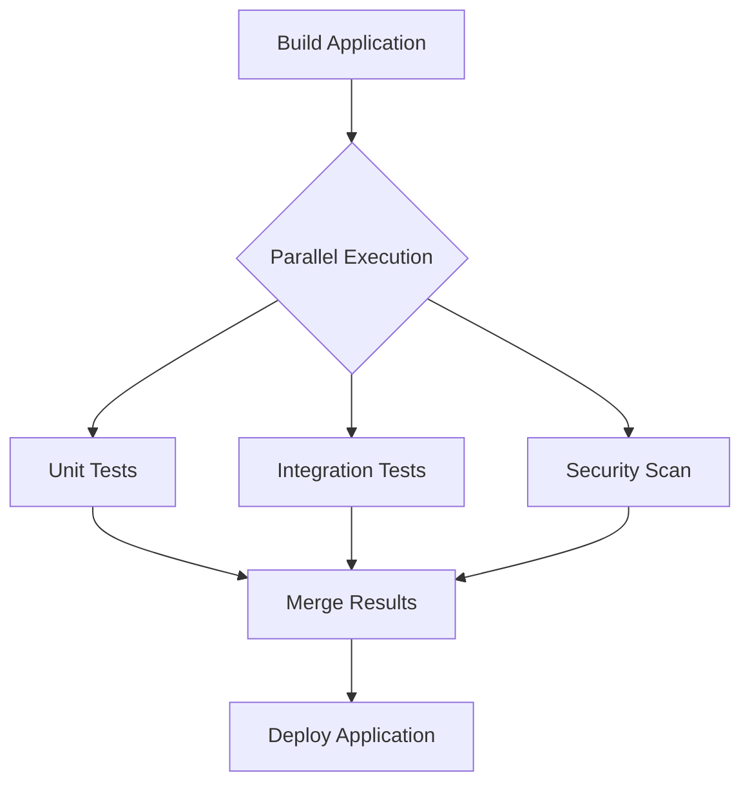

# Running Stages in Parallel in Jenkins

## Overview

In CI/CD pipelines, some tasks can run **independently of each other**. Running them sequentially increases the total pipeline execution time.

Jenkins allows multiple stages to run **in parallel**, enabling faster builds and more efficient use of system resources.

Parallel execution is commonly used for:

* running different types of tests
* building multiple components
* executing platform-specific builds
* performing security and quality scans simultaneously

By executing tasks concurrently, Jenkins pipelines become **significantly faster and more scalable**.

---

## Why Parallel Stages Are Important

Traditional pipelines execute stages **one after another**.

Example sequential workflow:

```
Build → Unit Tests → Integration Tests → Security Scan
```

If each stage takes **5 minutes**, the total pipeline time becomes:

```
5 + 5 + 5 + 5 = 20 minutes
```

With parallel execution:

```
Build → (Unit Tests | Integration Tests | Security Scan)
```

The pipeline may complete in **around 10 minutes instead of 20 minutes**.

Benefits of parallel execution:

* reduces pipeline runtime
* improves CI/CD efficiency
* utilizes multiple agents simultaneously
* speeds up feedback to developers

---

## How Parallel Execution Works in Jenkins

Jenkins pipelines allow stages to be grouped inside a **parallel block**.

Each branch inside the block runs **simultaneously** if sufficient executors or agents are available.

Typical parallel pipeline flow:



After all parallel branches finish, the pipeline continues to the next stage.

---

## Example: Basic Parallel Stages

Example Jenkinsfile using parallel stages:

```groovy
pipeline {
    agent any

    stages {

        stage('Build') {
            steps {
                sh 'npm install'
                sh 'npm run build'
            }
        }

        stage('Tests') {
            parallel {

                stage('Unit Tests') {
                    steps {
                        sh 'npm run test:unit'
                    }
                }

                stage('Integration Tests') {
                    steps {
                        sh 'npm run test:integration'
                    }
                }

                stage('Lint Check') {
                    steps {
                        sh 'npm run lint'
                    }
                }

            }
        }

    }
}
```

In this pipeline:

* three testing stages run **simultaneously**
* Jenkins schedules them on available executors
* the pipeline proceeds only after all finish

---

## Parallel Builds for Multiple Platforms

Parallel stages are often used to build software for **multiple operating systems or environments**.

Example:

```groovy
stage('Build for Platforms') {
    parallel {

        stage('Linux Build') {
            steps {
                sh './build-linux.sh'
            }
        }

        stage('Windows Build') {
            steps {
                bat 'build-windows.bat'
            }
        }

        stage('Mac Build') {
            steps {
                sh './build-mac.sh'
            }
        }

    }
}
```

This allows Jenkins to produce **multiple platform builds simultaneously**.

---

## Using Different Agents in Parallel Stages

Parallel stages can run on **different agents with specific environments**.

Example:

```groovy
stage('Parallel Tests') {
    parallel {

        stage('Java Tests') {
            agent { label 'java' }
            steps {
                sh 'mvn test'
            }
        }

        stage('Node Tests') {
            agent { label 'node' }
            steps {
                sh 'npm test'
            }
        }

    }
}
```

This ensures that each stage runs on a machine **configured for the required tools**.

---

## When to Use Parallel Stages

Parallel execution is useful when tasks:

* are independent of each other
* do not rely on outputs from other stages
* can run on separate agents

Common examples:

| Use Case              | Example                       |
| --------------------- | ----------------------------- |
| Testing               | unit tests, integration tests |
| Multi-platform builds | Linux, Windows, Mac           |
| Microservices builds  | service A, service B          |
| Quality checks        | linting, security scans       |

---

## Limitations of Parallel Stages

Parallel execution is powerful but requires careful use.

Potential limitations:

* requires enough executors or agents
* debugging may be slightly harder
* logs from multiple stages appear simultaneously

If resources are limited, some parallel stages may **wait for available executors**.

---

## Best Practices for Parallel Pipelines

### 1. Parallelize Independent Tasks

Only parallelize stages that **do not depend on each other**.

Example:

```
Unit Tests
Integration Tests
Security Scans
```

---

### 2. Keep Parallel Stages Balanced

Avoid one stage taking significantly longer than others.

Example imbalance:

```
Unit Tests → 2 minutes
Integration Tests → 20 minutes
```

This reduces the benefit of parallel execution.

---

### 3. Use Dedicated Agents

Assign different agents when tasks require different environments.

Example:

```
Java Agent
Node.js Agent
Docker Agent
```

---

### 4. Limit Excessive Parallelism

Running too many parallel tasks may overload infrastructure.

Control this using:

* executor limits
* resource management

---

## Interview Questions

### 1. What are parallel stages in Jenkins?

**Answer:**

Parallel stages allow multiple pipeline stages to run simultaneously to reduce pipeline execution time.

---

### 2. When should parallel stages be used?

**Answer:**

Parallel stages should be used when tasks are independent and can run concurrently.

---

### 3. What happens after parallel stages complete?

**Answer:**

Jenkins waits for all parallel branches to finish before continuing the pipeline.

---

### 4. Do parallel stages require multiple agents?

**Answer:**

Not necessarily, but multiple executors or agents improve parallel execution efficiency.

---

### 5. What are common use cases for parallel pipelines?

**Answer:**

Running tests, multi-platform builds, microservice builds, and security scans.

---

## Summary

* Jenkins supports **parallel stage execution** in pipelines

* Parallel stages allow multiple tasks to run simultaneously

* This reduces **pipeline execution time**

* Parallel stages are useful for **tests, builds, and quality checks**

* Jenkins waits for all parallel tasks to finish before continuing

* Proper use of parallel execution improves **CI/CD efficiency and scalability**

---
