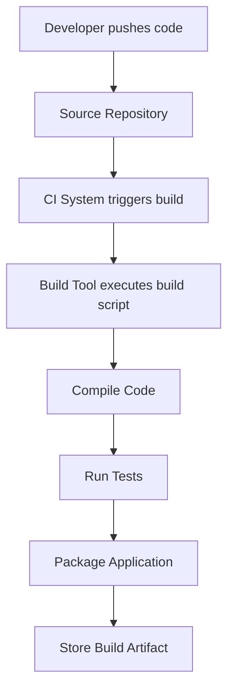

# What is Build Automation

## Overview

**Build Automation** is the process of automatically compiling source code, running tests, packaging applications, and preparing software artifacts without manual intervention.

Instead of developers manually performing build steps, specialized tools execute a predefined **build pipeline**.

Common build automation tools include:

* **Maven**
* **Gradle**
* **Make**
* **Ant**
* **Bazel**

In modern DevOps environments, build automation is usually integrated with **CI/CD tools such as Jenkins, GitHub Actions, or GitLab CI**.

---

## Why Build Automation Is Important

In traditional development workflows, building software involved manual steps such as:

* compiling code
* resolving dependencies
* running tests
* packaging the application

Manual processes often lead to:

* inconsistent builds
* human errors
* environment issues
* slow development cycles

Build automation solves these problems by making the build process **repeatable, reliable, and consistent**.

---

## What a Build Process Includes

A typical build process consists of several steps:

* **Fetching source code**

* **Resolving dependencies**

* **Compiling source code**

* **Running automated tests**

* **Packaging the application**

* **Generating build artifacts**

Example workflow:



These steps are automatically executed using build tools.

---

## Key Components of Build Automation

### 1. Source Code Compilation

Compilation converts human-readable code into executable programs or intermediate bytecode.

Examples:

* **Java → bytecode (.class files)**
* **C++ → machine code**
* **TypeScript → JavaScript**

The build tool manages compilation automatically.

---

### 2. Dependency Management

Most applications rely on external libraries.

Build automation tools automatically:

* download dependencies
* resolve versions
* manage library conflicts

Example:

```id="n31g9t"
Java Project
   │
   ├── Spring Framework
   ├── Jackson Library
   └── Log4j
```

Tools like **Maven and Gradle** fetch these dependencies from repositories.

---

### 3. Automated Testing

Build pipelines often run automated tests to verify that new code changes do not break existing functionality.

Common test types:

* **Unit tests**
* **Integration tests**
* **Static code analysis**

If tests fail, the build process stops.

---

### 4. Packaging

After successful compilation and testing, the application is packaged into a distributable format.

Examples:

| Application Type | Package Format      |
| ---------------- | ------------------- |
| Java             | JAR / WAR           |
| Node.js          | bundled application |
| Python           | wheel / package     |
| Dockerized apps  | Docker image        |

Packaging prepares the software for deployment.

---

### 5. Artifact Generation

The final output of a build process is called a **build artifact**.

Examples:

* compiled binaries
* JAR/WAR files
* Docker images
* static website bundles

Artifacts are typically stored in **artifact repositories** like:

* Nexus
* Artifactory
* Docker Registry

---

## Example: Maven Build Lifecycle

Maven defines a structured **build lifecycle**.

Common phases include:

| Phase    | Description                    |
| -------- | ------------------------------ |
| Validate | Validate project structure     |
| Compile  | Compile source code            |
| Test     | Run unit tests                 |
| Package  | Create deployable artifact     |
| Install  | Install artifact locally       |
| Deploy   | Publish artifact to repository |

Example command:

```bash
mvn clean install
```

This command:

1. cleans previous builds
2. compiles code
3. runs tests
4. generates artifacts

---

## Example Build Script

Example **Gradle build configuration**:

```groovy
plugins {
    id 'java'
}

group = 'com.example'
version = '1.0'

repositories {
    mavenCentral()
}

dependencies {
    testImplementation 'junit:junit:4.13'
}

test {
    useJUnit()
}
```

This script defines:

* project configuration
* dependencies
* test framework

---

## Build Automation in CI/CD Pipelines

Build automation is often triggered by CI systems.

Example CI pipeline:

```
Developer pushes code
        ↓
CI server triggers build
        ↓
Build tool compiles code
        ↓
Tests run automatically
        ↓
Application packaged
        ↓
Artifact stored
        ↓
Deployment pipeline starts
```

Build automation is therefore a **core part of Continuous Integration**.

---

## Advantages of Build Automation

| Advantage              | Explanation                                       |
| ---------------------- | ------------------------------------------------- |
| Consistency            | Builds are reproducible across environments       |
| Speed                  | Automated builds run faster than manual processes |
| Reduced Errors         | Eliminates human mistakes                         |
| Continuous Integration | Enables automatic validation of code              |
| Dependency Management  | Automatically handles libraries                   |

---

## Challenges of Build Automation

| Challenge            | Explanation                                 |
| -------------------- | ------------------------------------------- |
| Initial Setup        | Build configuration may take time           |
| Tool Complexity      | Some build tools have steep learning curves |
| Dependency Conflicts | Version conflicts may occur                 |
| Maintenance          | Build scripts require updates               |

---

## Interview Questions

### 1. What is build automation?

**Answer:**

Build automation is the process of automatically compiling code, running tests, packaging applications, and generating deployable artifacts using build tools.

---

### 2. Why is build automation important?

**Answer:**

It ensures builds are consistent, repeatable, faster, and less prone to human errors.

---

### 3. What are common build automation tools?

**Answer:**

Common tools include Maven, Gradle, Make, Ant, and Bazel.

---

### 4. What is a build artifact?

**Answer:**

A build artifact is the final output produced by a build process, such as compiled binaries, JAR files, or Docker images.

---

### 5. How does build automation relate to CI/CD?

**Answer:**

Build automation is a core component of CI/CD pipelines where code changes automatically trigger builds and tests.

---

## Summary

* **Build automation** automates the process of compiling, testing, and packaging applications

* It ensures **consistent and reliable builds**

* Build tools manage **dependencies, compilation, and packaging**

* It integrates with **CI/CD pipelines** to enable continuous software delivery

* Automated builds improve **speed, reliability, and developer productivity**

---
