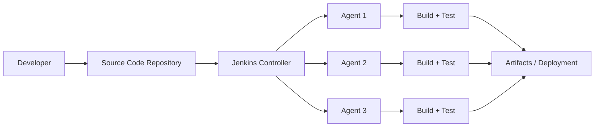
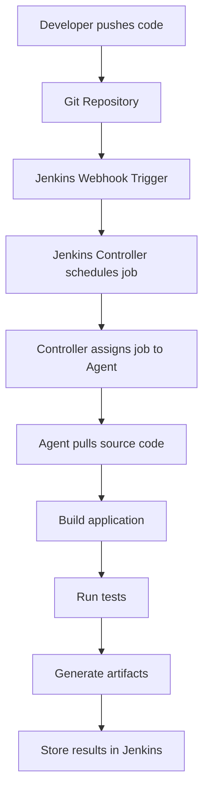
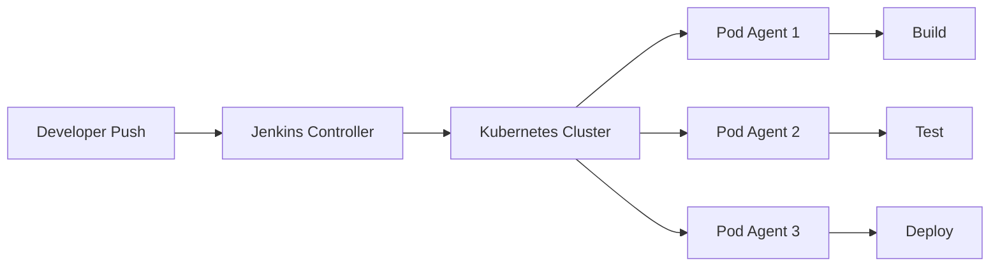

# Understanding Jenkins Architecture

## Overview

**Jenkins Architecture** defines how Jenkins organizes and distributes work to automate software build, test, and deployment processes.

At a high level, Jenkins follows a **Controller–Agent architecture**, where a central server coordinates tasks and worker nodes execute them.

This architecture allows Jenkins to:

* distribute workloads
* support multiple environments
* scale CI/CD pipelines
* run parallel builds

---

## Why Jenkins Uses This Architecture

If a single server handled all build tasks:

* builds would queue up
* pipelines would run slowly
* resource usage would spike
* system stability would suffer

Large teams may run **dozens or hundreds of builds simultaneously**.

To solve this, Jenkins separates:

* **orchestration (controller)**
* **execution (agents)**

This allows the system to **scale horizontally** by adding more worker machines.

---

## High-Level Architecture

The basic Jenkins architecture looks like this:



The controller coordinates tasks while agents perform the heavy work.

---

## Core Components of Jenkins Architecture

### 1. Jenkins Controller (Master)

The **Jenkins Controller** is the central component of the system.

It is responsible for managing the entire CI/CD workflow.

Main responsibilities:

* scheduling jobs
* managing pipelines
* distributing tasks to agents
* storing build history
* managing plugins
* managing credentials
* handling user authentication

The controller **does not usually run builds itself** in large production environments.

---

### 2. Responsibilities of the Controller

| Responsibility         | Description                            |
| ---------------------- | -------------------------------------- |
| Job Scheduling         | Decides when builds should run         |
| Pipeline Orchestration | Coordinates pipeline stages            |
| Plugin Management      | Installs and manages plugins           |
| Security               | Handles authentication and permissions |
| Build Metadata         | Stores logs, artifacts, and history    |

---

### 3. Jenkins Agents (Workers)

**Agents** are machines that execute the build tasks assigned by the controller.

Agents can run on:

* separate servers
* virtual machines
* containers
* cloud instances

They perform the resource-intensive work such as:

* compiling code
* running tests
* building Docker images
* packaging artifacts

---

### 4. Why Agents Are Important

Agents allow Jenkins to:

* run multiple builds simultaneously
* support multiple operating systems
* isolate build environments
* scale CI pipelines

Example:

```
Agent 1 → Java builds
Agent 2 → Node.js builds
Agent 3 → Python builds
```

Each agent can have different tools installed.

---

### 5. Communication Between Controller and Agents

The controller communicates with agents using secure channels.

Common communication methods:

| Method            | Description                                                     |
| ----------------- | --------------------------------------------------------------- |
| SSH               | Controller connects to agent using SSH                          |
| JNLP              | Agent connects to controller using Java Network Launch Protocol |
| Kubernetes Plugin | Agents are created dynamically as containers                    |

JNLP is commonly used when agents **initiate the connection** to the controller.

---

## Jenkins Build Execution Flow

When a developer pushes code, the following sequence happens:



This workflow ensures builds are **automated and reproducible**.

---

## Jenkins Distributed Build System

One of Jenkins’ most powerful capabilities is **distributed builds**.

Instead of running everything on one machine, Jenkins distributes tasks across multiple agents.

Example:

```
Controller
   │
   ├── Agent 1 → Backend build
   ├── Agent 2 → Frontend build
   └── Agent 3 → Integration tests
```

This allows pipelines to run **much faster**.

---

## Static vs Dynamic Agents

Jenkins agents can be **static or dynamic**.

### 1. Static Agents

Static agents are permanently connected machines.

Examples:

* dedicated build servers
* physical machines
* long-running VMs

Pros:

* stable
* predictable

Cons:

* waste resources when idle

---

### 2. Dynamic Agents

Dynamic agents are created **on demand**.

Examples:

* Docker containers
* Kubernetes pods
* cloud VMs

Pros:

* cost efficient
* highly scalable
* isolated environments

Dynamic agents are common in **modern cloud CI/CD systems**.

---

## Jenkins with Container-Based Agents

Modern Jenkins setups often use **Docker or Kubernetes agents**.

Example architecture:



Agents are created as temporary containers and destroyed after the build.

---

## Artifact Storage

Build outputs (artifacts) are stored after pipelines run.

Examples:

* compiled binaries
* Docker images
* test reports

Artifacts may be stored in:

* Jenkins server
* Nexus
* Artifactory
* Docker registries
* cloud storage

---


## Pros and Cons

| Advantages                  | Disadvantages                             |
| --------------------------- | ----------------------------------------- |
| Scalable                    | Initial setup can be complex              |
| Flexible                    | Requires maintenance                      |
| Large plugin ecosystem      | Can be resource intensive                 |
| Supports distributed builds | Plugin conflicts may occur                |


## Interview Questions

### 1. What is Jenkins architecture?

**Answer:**

Jenkins follows a **controller-agent architecture** where the controller manages pipelines and agents execute build tasks.

---

### 2. What is the role of the Jenkins controller?

**Answer:**

The controller schedules jobs, manages pipelines, stores build data, and distributes tasks to agents.

---

### 3. What are Jenkins agents?

**Answer:**

Agents are worker machines that execute build, test, and deployment tasks assigned by the Jenkins controller.

---

### 4. Why are distributed builds important in Jenkins?

**Answer:**

Distributed builds allow Jenkins to run multiple pipelines simultaneously, improving performance and scalability.

---

### 5. What is the difference between static and dynamic agents?

**Answer:**

Static agents are permanent machines, while dynamic agents are created on demand (often using Docker or Kubernetes).

---

## Summary

* Jenkins follows a **controller-agent architecture**

* The **controller orchestrates CI/CD pipelines**

* **Agents execute build tasks**

* Distributed builds allow Jenkins to scale efficiently

* Modern Jenkins setups often use **Docker or Kubernetes agents**

* This architecture enables **fast, automated, and scalable CI/CD pipelines**

---
