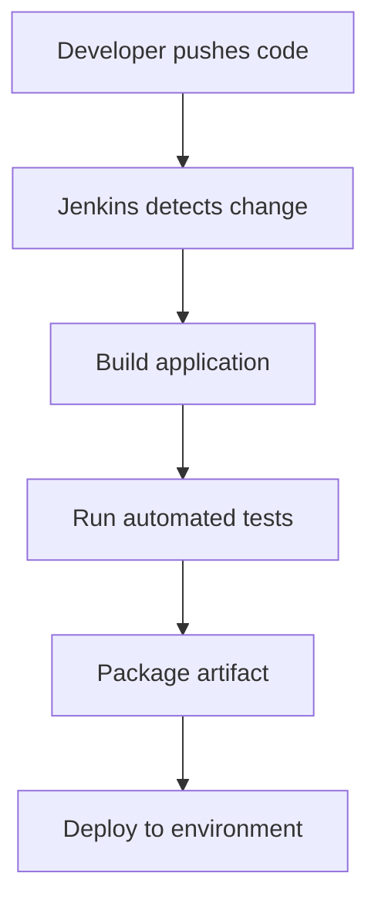

# Introduction to Jenkins

## Overview

**Jenkins** is an open-source automation server used to implement **Continuous Integration (CI)** and **Continuous Delivery/Deployment (CD)** pipelines.

It automates the process of:

- building code  
- running tests  
- packaging applications  
- deploying software  

Jenkins helps development teams deliver software **faster, more reliably, and with fewer manual errors**.

---

## Why Jenkins Is Used

In traditional development workflows:

- developers write code  
- code is manually built  
- tests are run manually  
- deployments require human intervention  

This process is slow and error-prone.

Jenkins automates these steps, allowing teams to build and deploy applications continuously.

---

## What Jenkins Does

Jenkins acts as an **automation engine** that triggers actions based on events. The workflow typically looks like this:




This automated pipeline ensures consistent and reliable software delivery.

---

## Continuous Integration (CI)

Continuous Integration means developers frequently merge code into a shared repository.

Jenkins automatically:

- builds the project  
- runs unit tests  
- detects integration issues early  

This reduces the risk of broken builds.

---

## Continuous Delivery / Deployment (CD)

After CI, Jenkins can also automate deployment.

Two common approaches:

**Continuous Delivery**

- builds are always deployable  
- deployment requires manual approval

**Continuous Deployment**

- builds are automatically deployed to production

Jenkins supports both strategies.

---

## Key Jenkins Concepts

### Jenkins Server

The Jenkins server is the main application responsible for:

- running pipelines  
- managing jobs  
- storing build history  
- orchestrating automation tasks

---

### Job

A **job** defines a specific automated task.

Examples:

- build Java application  
- run unit tests  
- deploy Docker container

Jobs can be triggered manually or automatically.

---

### Pipeline

A **pipeline** defines a sequence of stages in software delivery.

Example pipeline stages:

```
Build → Test → Package → Deploy
```

Pipelines are often defined using a `Jenkinsfile`.

---

### Jenkinsfile

A **Jenkinsfile** is a script that defines the pipeline.

Example:

```groovy
pipeline {
    agent any

    stages {
        stage('Build') {
            steps {
                sh 'npm install'
            }
        }

        stage('Test') {
            steps {
                sh 'npm test'
            }
        }
    }
}
```

This file lives inside the source repository.

---

### Plugins

Jenkins has a powerful plugin ecosystem.

Plugins allow integration with:

* GitHub / GitLab
* Docker
* Kubernetes
* AWS
* Slack notifications
* testing frameworks

Over **1800+ plugins** exist.

---

## Jenkins Architecture

Basic architecture:

```
Developer
   ↓
Source Control (Git)
   ↓
Jenkins Server
   ↓
Build Agents
   ↓
Artifacts / Deployments
```

---

### Jenkins Controller (Master)

The controller manages:

* pipeline scheduling
* job configuration
* plugin management
* build orchestration

---

### Jenkins Agents (Workers)

Agents execute build tasks.

Benefits:

* distribute workloads
* support multiple environments
* scale CI pipelines

---

## Jenkins in Modern DevOps

Jenkins commonly integrates with:

* Git repositories (GitHub, GitLab)
* container platforms (Docker, Kubernetes)
* artifact repositories (Nexus, Artifactory)
* cloud providers (AWS, GCP, Azure)

It acts as the **central automation hub**.

---

## Typical Jenkins CI/CD Pipeline

Example backend workflow:

```
Developer pushes code to Git
        ↓
Jenkins triggers build
        ↓
Compile application
        ↓
Run unit tests
        ↓
Build Docker image
        ↓
Push image to registry
        ↓
Deploy application
```

This ensures repeatable and automated software delivery.

---

## Pros and Cons of Jenkins

| Advantages                          | Disadvantages                         |
|-------------------------------------|---------------------------------------|
| Open-source and free                | Can be complex to set up and maintain  |
| Large plugin ecosystem              | UI can be less intuitive               |
| Supports distributed builds         | May require significant resources      |
| Flexible and extensible             | Security concerns if not configured properly |

---


## Interview Questions

### 1. What is Jenkins?

**Answer:**
Jenkins is an open-source automation server used for CI/CD pipelines.

---

### 2. What is Continuous Integration?

**Answer:**
Continuous Integration is the practice of automatically building and testing code whenever changes are merged.

---

### 3. What is a Jenkins pipeline?

**Answer:**
A pipeline defines the stages of an automated software delivery workflow.

---

### 4. What is a Jenkinsfile?

**Answer:**
A Jenkinsfile is a script that defines CI/CD pipeline stages in code.

---

### 5. What role do Jenkins agents play?

**Answer:**
Agents execute build tasks delegated by the Jenkins controller.

---

## Summary

* Jenkins automates software build, test, and deployment processes

* It enables Continuous Integration and Continuous Delivery

* Pipelines define automated workflows

* Plugins extend Jenkins functionality

* Jenkins is a central component in many DevOps pipelines

---
