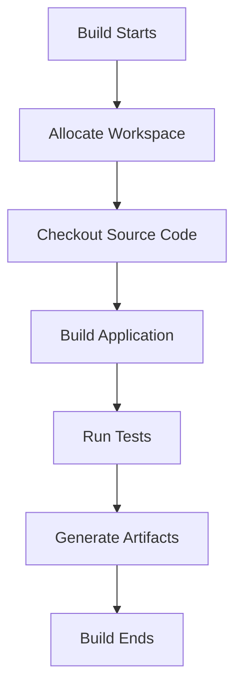
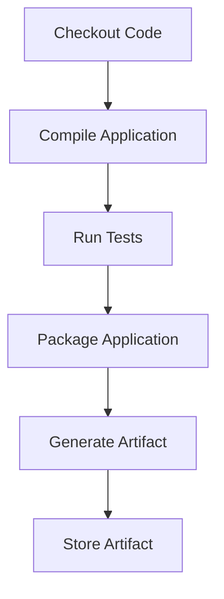
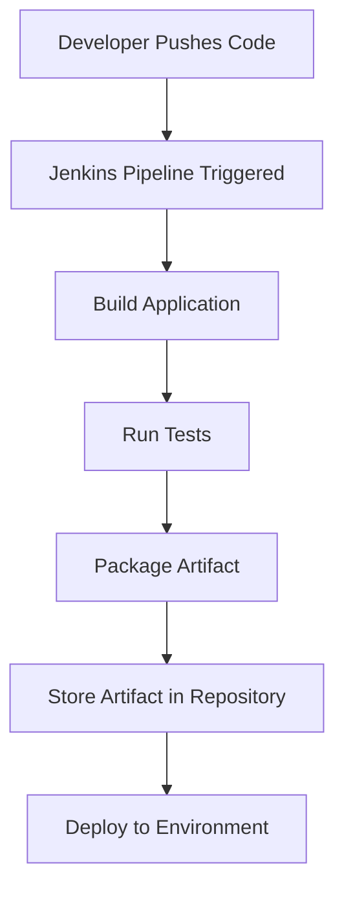

# Jenkins Workspace and Storing Build Artifacts

## Overview

In Jenkins, every build requires a working directory where the pipeline can execute tasks such as:

* cloning source code
* compiling applications
* running tests
* generating artifacts

This directory is called the **Jenkins Workspace**.

After the build process completes, the outputs of the build — known as **build artifacts** — are stored either inside Jenkins or in external artifact repositories.

Understanding how Jenkins manages **workspaces and artifacts** is essential for building reliable CI/CD pipelines.

---

## Jenkins Workspace

### What is a Jenkins Workspace?

A **Jenkins Workspace** is a directory on a Jenkins agent where the source code is checked out and build operations are executed.

Each job or pipeline typically has its own workspace.

Example workspace structure:

```text
JENKINS_HOME/
   └── workspace/
        └── backend-service/
              ├── src/
              ├── tests/
              ├── package.json
              ├── Dockerfile
              └── build/
```

Inside the workspace, Jenkins performs operations such as:

* cloning the Git repository
* compiling source code
* running tests
* generating build outputs

---

### Why Jenkins Uses Workspaces

Workspaces provide an isolated environment for each build.

This ensures:

* builds do not interfere with each other
* pipelines run independently
* build outputs remain organized

Benefits of workspaces:

| Benefit      | Explanation                             |
| ------------ | --------------------------------------- |
| Isolation    | Each job runs in its own directory      |
| Organization | Build files are separated by project    |
| Debugging    | Logs and artifacts are easier to trace  |
| Reusability  | Cached dependencies can speed up builds |

---

## Workspace Lifecycle

Each Jenkins build interacts with the workspace during different phases.

Typical lifecycle:



After the build completes, Jenkins may keep or clean the workspace depending on configuration.

---

## Workspace Allocation in Jenkins

When a job runs, Jenkins assigns a workspace on the agent.

Example structure on the agent machine:

```text
/var/lib/jenkins/workspace/
    ├── backend-service/
    ├── frontend-app/
    └── microservice-auth/
```

If multiple builds run simultaneously, Jenkins may create **temporary workspaces**:

```text
workspace/backend-service
workspace/backend-service@2
workspace/backend-service@3
```

This prevents conflicts between concurrent builds.

---

## Cleaning the Workspace

Old build files can cause problems such as:

* outdated dependencies
* leftover artifacts
* inconsistent builds

To prevent this, Jenkins can clean the workspace before a build.

Example pipeline step:

```groovy
pipeline {
    agent any

    stages {
        stage('Clean Workspace') {
            steps {
                cleanWs()
            }
        }
    }
}
```

This removes previous files and ensures a fresh environment.

---

## Build Artifacts in Jenkins

### What Are Build Artifacts?

**Build artifacts** are the final outputs produced during a build process.

Examples include:

* compiled binaries
* JAR/WAR files
* Docker images
* test reports
* packaged applications

Artifacts are important because they represent **the deployable version of the application**.

---

### Artifact Generation Workflow

During the build process, artifacts are generated after successful compilation and testing.



Artifacts are then used in later stages such as deployment.

---

## Storing Build Artifacts in Jenkins

Jenkins allows artifacts to be stored directly within the build history.

Example pipeline configuration:

```groovy
pipeline {
    agent any

    stages {
        stage('Build') {
            steps {
                sh 'mvn package'
            }
        }
    }

    post {
        success {
            archiveArtifacts artifacts: 'target/*.jar'
        }
    }
}
```

This command archives all `.jar` files produced during the build.

---

### Where Jenkins Stores Artifacts

Artifacts are stored in the Jenkins build directory.

Example structure:

```text
JENKINS_HOME/
   └── jobs/
        └── backend-service/
             └── builds/
                  └── 42/
                       ├── archive/
                       │    └── backend-service.jar
                       └── build.xml
```

Each build has its own archive directory.

---

## Using External Artifact Repositories

In production environments, artifacts are usually stored outside Jenkins.

Common artifact repositories:

* **Nexus Repository**
* **JFrog Artifactory**
* **AWS S3**
* **Docker Registry**

Reasons for external storage:

| Reason             | Explanation                               |
| ------------------ | ----------------------------------------- |
| Scalability        | Large artifacts can fill Jenkins storage  |
| Version Management | Artifacts can be versioned                |
| Sharing            | Multiple teams can access artifacts       |
| Security           | Controlled access to production artifacts |

---

## Artifact Storage in CI/CD Pipeline

Example backend CI pipeline:



Artifacts serve as the **bridge between build and deployment stages**.

---

## Best Practices

### Clean Workspaces Regularly

Prevent inconsistent builds by cleaning old files.

---

### Store Only Necessary Artifacts

Avoid storing unnecessary files that consume storage.

---

### Use External Artifact Repositories

Large projects should use dedicated artifact repositories.

---

### Version Artifacts

Versioning ensures builds are traceable and reproducible.

Example:

```text
backend-service-1.0.0.jar
backend-service-1.1.0.jar
backend-service-2.0.0.jar
```

---

## Interview Questions

### 1. What is a Jenkins workspace?

**Answer:**

A Jenkins workspace is the directory on a Jenkins agent where the source code is checked out and the build process is executed.

---

### 2. What are build artifacts?

**Answer:**

Build artifacts are the final outputs produced during a build process, such as compiled binaries, JAR files, or Docker images.

---

### 3. How are artifacts stored in Jenkins?

**Answer:**

Artifacts can be stored using the `archiveArtifacts` step in pipelines, which archives files in the Jenkins build directory.

---

### 4. Why are external artifact repositories used?

**Answer:**

They provide better scalability, version management, security, and sharing across teams.

---

### 5. What is the difference between workspace and artifacts?

**Answer:**

A workspace is a temporary directory used during the build process, while artifacts are the final outputs stored after the build completes.

---

## Summary

* A **Jenkins workspace** is the directory where builds run

* It contains source code, dependencies, and intermediate build files

* **Build artifacts** are the final outputs produced during the build

* Jenkins can store artifacts internally or in external repositories

* Artifacts are critical for deployment and release management

* Proper workspace management ensures **clean and reliable builds**

---
