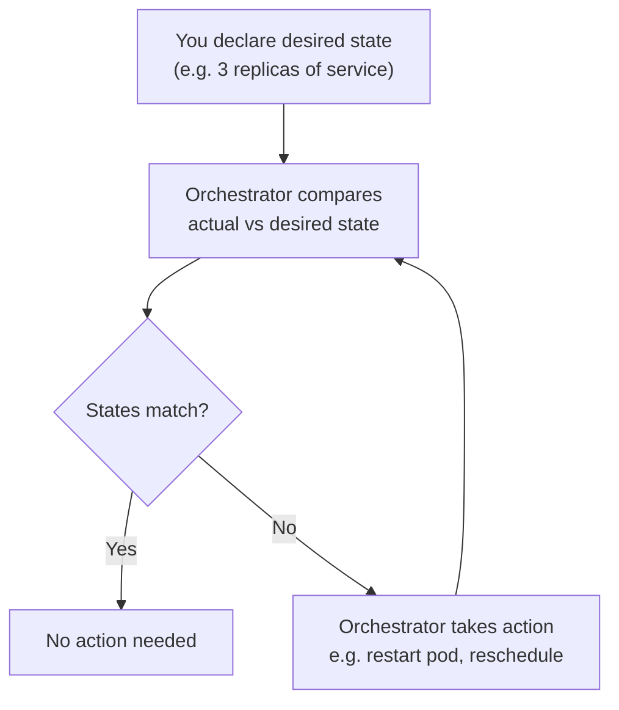

# Container Orchestration

## Overview

As systems scale from a handful of containers to hundreds or thousands, manually managing them becomes impractical.

**Container orchestration** is the automated management of containerized workloads — handling deployment, scaling, networking, health monitoring, and recovery across a cluster of machines.

Orchestration tools are what make containers viable for production-grade backend systems.

---

## The Problem at Scale

Running a single container on a single machine is straightforward.

But real-world production systems require:

- running many containers across many machines
- ensuring containers restart if they crash
- distributing incoming traffic across healthy containers
- rolling out updates without downtime
- scaling services up or down based on load
- managing secrets and configuration securely

Doing all of this manually is error-prone and unsustainable.

Container orchestration solves this by **automating the operational work of running containers at scale**.

---

## What Container Orchestration Does

An orchestration system handles the following automatically:

### Scheduling

Determines **which host machine** a container should run on, based on available CPU, memory, affinity rules, and resource requests declared in the container spec.

### Self-Healing

Monitors running containers and automatically restarts crashed containers, replaces containers on failed nodes, and kills containers that fail health checks.

The system ensures the **desired number of instances is always maintained**.

### Scaling

Adjusts the number of running container instances in response to traffic or load:

- **horizontal scaling** — add or remove container replicas
- **vertical scaling** — adjust resource limits per container

Scaling can be manual or automatic based on configured thresholds.

### Load Balancing

Distributes incoming network traffic across multiple healthy container instances, preventing overload on any single container.

### Rolling Deployments and Rollbacks

Updates running containers gradually — deploying new versions one at a time while health checks pass, and rolling back automatically if the new version fails.

This enables **zero-downtime deployments**.

### Configuration and Secret Management

Provides a secure way to inject environment-specific configuration, database credentials, API keys, and TLS certificates — without embedding secrets in container images.

### Service Discovery

Enables containers to locate and communicate with each other **without hardcoded IPs**, using internal DNS or proxy-based routing provided by the orchestrator.

---

## How Orchestration Works

This reconciliation loop runs continuously, making the system self-correcting without manual intervention.

---

## Popular Orchestration Platforms

| Platform            | Description                                                          |
| ------------------- | -------------------------------------------------------------------- |
| **Kubernetes**      | Industry-standard open-source orchestration system                   |
| **Docker Swarm**    | Simpler orchestration built into Docker                              |
| **Amazon ECS**      | Managed container orchestration on AWS                               |
| **HashiCorp Nomad** | Lightweight workload orchestrator supporting containers and binaries |

Kubernetes is the dominant standard and is used across most cloud providers including AWS (EKS), GCP (GKE), and Azure (AKS).

---

## Key Concepts in Any Orchestration System

### Cluster

A **cluster** is a group of machines (nodes) managed as a single unit by the orchestrator, typically consisting of a **control plane** (manages state and scheduling) and **worker nodes** (run the actual containers).

### Desired State

You declare what you want (e.g., "3 replicas of this service running"), and the orchestrator continuously works to ensure that state is achieved and maintained.

### Node

An individual machine (physical or virtual) in the cluster that runs containerized workloads.

### Service

A logical grouping of container instances that performs a specific function, with a stable network identity.

---

## Why Orchestration Is Essential for Backend Engineering

Modern backend systems are built on microservices — dozens of small services communicating over a network.

Without orchestration, managing these services at scale is not feasible.

Orchestration provides:

- **Reliability** — self-healing and automatic recovery
- **Scalability** — handle traffic spikes without manual intervention
- **Efficiency** — maximize hardware utilization across nodes
- **Velocity** — ship updates safely and quickly
- **Observability** — built-in health checks and event tracking

Orchestration is not optional at production scale — it is foundational.

---

## Interview Questions

### 1. What is container orchestration and why is it needed?

**Answer:**
Container orchestration is the automated management of containerized workloads at scale — handling restarts, scaling, routing, and deployments that would be impractical to do manually.

---

### 2. What does self-healing mean in the context of orchestration?

**Answer:**
The orchestrator automatically detects crashed containers or failed nodes and restores the desired number of healthy instances without human intervention.

---

### 3. What is the difference between horizontal and vertical scaling?

**Answer:**
Horizontal scaling adds or removes container replicas; vertical scaling increases the CPU or memory of existing containers. Orchestrators primarily use horizontal scaling.

---

### 4. How does an orchestrator enable zero-downtime deployments?

**Answer:**
Through rolling updates — containers are replaced one at a time with the new version while health checks pass, so healthy instances are always serving traffic.

---

### 5. What is desired state management?

**Answer:**
You declare the intended state (e.g., 5 replicas), and the orchestrator continuously monitors and takes corrective action to reconcile actual state with the declared desired state.

---

## Summary

- Container orchestration automates the deployment, scaling, networking, and management of containers at scale

- It handles scheduling, self-healing, load balancing, rolling deployments, and configuration management

- Orchestration works by continuously reconciling actual state with declared desired state

- Kubernetes is the dominant platform and industry standard for container orchestration

- Orchestration is a prerequisite for running containerized backend systems reliably in production

---
