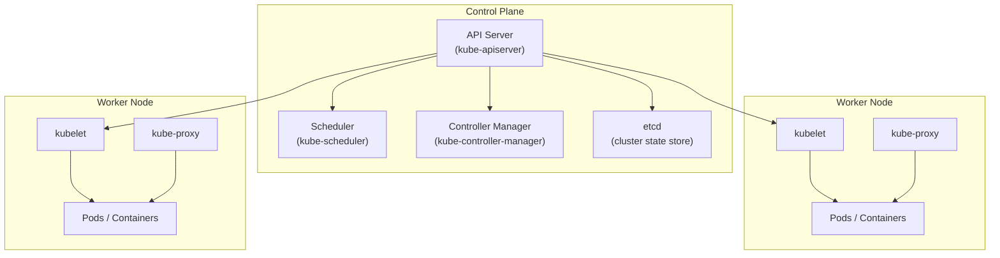

# Overview of Kubernetes

## Overview

**Kubernetes** (also written as **K8s**) is an open-source container orchestration platform that automates the **deployment, scaling, self-healing, and management** of containerized applications across a cluster of machines.

Originally developed by Google based on internal systems called Borg and Omega, Kubernetes was open-sourced in 2014 and is now maintained by the **Cloud Native Computing Foundation (CNCF)**.

It is the **industry standard** for running containerized workloads in production.

---

## Why Kubernetes Exists

Docker and containers solved the problem of packaging and running applications consistently.

But as systems grew larger, new problems emerged:

- how to run **containers** across many machines

- how to **scale** applications up and down based on demand

- how to **heal** applications when they fail

- how to **expose** applications to users and other services


Kubernetes was built to answer all of these questions with a single, unified platform.

---

## What Kubernetes Does

Kubernetes provides a control layer on top of your container runtime that handles:

| Feature              | Description                                                                 |
| -------------------- | --------------------------------------------------------------------------- |
| **Automated Deployment** | Deploy and update applications without downtime using rolling updates.       |
| **Self-Healing**     | Automatically restart failed containers, replace and reschedule them.       |
| **Horizontal Scaling** | Scale applications up or down based on CPU usage or custom metrics.         |
| **Service Discovery** | Automatically expose services to other services within the cluster.         |
| **Load Balancing**   | Distribute traffic across multiple instances of a service.              |
| **Storage Orchestration** | Automatically mount storage systems like local disks, cloud storage, or network storage. |
| **Secret and Configuration Management** | Manage sensitive information and configuration separately from application code. |

---

## Kubernetes Cluster Architecture

A Kubernetes cluster consists of two main parts — the **Control Plane** and the **Worker Nodes**.



---

## Control Plane

The control plane is the **brain of the cluster**. It manages cluster state, makes scheduling decisions, and drives the system toward the desired state.

### 1. API Server (kube-apiserver)

The central entry point for all cluster operations.

- exposes the Kubernetes REST API
- all communication with the cluster goes through the API server
- validates and processes API requests

Every `kubectl` command hits the API server.

### 2. etcd

A distributed key-value store that holds the **entire cluster state**.

- stores node information, pod definitions, configuration, secrets
- the single source of truth for the cluster

If etcd is lost, the cluster loses all state.

### 3. Scheduler (kube-scheduler)

Decides **which worker node** a new pod should run on, based on resource availability, affinity rules, taints, and node selectors.

### 4. Controller Manager (kube-controller-manager)

Runs control loops that continuously monitor cluster state and take corrective action.

Examples of controllers:

- **ReplicaSet controller** — ensures the correct number of pod replicas are running
- **Node controller** — detects and responds to node failures
- **Deployment controller** — manages rolling updates

---

## Worker Nodes

Worker nodes are the machines that **actually run your containers**.

Each worker node runs:

### 1. Kubelet

An agent that communicates with the API server, ensures containers described in pod specs are running and healthy, and reports status back to the control plane.

### 2. Kube-proxy

A network proxy that maintains network rules on the node, enabling service discovery and load balancing within the cluster.

### 3. Container Runtime

The software that actually runs containers on the node. Kubernetes supports **containerd**, CRI-O, and other CRI-compatible runtimes.

---

## Core Kubernetes Objects

Kubernetes manages applications through a set of declarative objects defined in YAML files.

### 1. Pod

The **smallest deployable unit** in Kubernetes.

- wraps one or more containers
- containers in the same pod share the same network namespace and storage
- pods are ephemeral — they can be created, killed, and replaced

```yaml
apiVersion: v1
kind: Pod
metadata:
  name: backend-pod
spec:
  containers:
    - name: app
      image: myapp:1.0
      ports:
        - containerPort: 8080
```

### 2. Deployment

Manages the **desired number of pod replicas** and handles rolling updates.

- you declare how many replicas you want
- the Deployment controller ensures they are always running
- handles rolling updates and rollbacks automatically

```yaml
apiVersion: apps/v1
kind: Deployment
metadata:
  name: backend-deployment
spec:
  replicas: 3
  selector:
    matchLabels:
      app: backend
  template:
    metadata:
      labels:
        app: backend
    spec:
      containers:
        - name: app
          image: myapp:1.0
```

### 3. Service

Provides a **stable network endpoint** to access pods.

- pods have dynamic IPs that change when restarted
- a Service gives a fixed DNS name and IP that routes to the underlying pods
- enables load balancing across pod replicas

Types of Services:

| Type         | Description                                    |
| ------------ | ---------------------------------------------- |
| ClusterIP    | Internal access only within the cluster        |
| NodePort     | Exposes the service on a port on each node     |
| LoadBalancer | Creates an external load balancer (cloud only) |

### 4. ConfigMap and Secret

- **ConfigMap** — stores non-sensitive configuration data (environment variables, config files)
- **Secret** — stores sensitive data (passwords, tokens, TLS certificates) in base64 encoded form

### 5. Namespace

Provides **logical isolation** within a cluster.

- useful for separating environments (dev, staging, prod) within the same cluster
- resources in different namespaces are isolated by default

---

## How Kubernetes Manages Desired State

Kubernetes operates on the **desired state model**.

1. You declare the intended state in a YAML manifest (e.g., "3 replicas of this pod")
2. You apply the manifest with `kubectl apply`
3. Controllers in the control plane continuously monitor actual state
4. If actual state diverges from desired state, controllers reconcile the difference

This means:

- if a pod crashes, Kubernetes starts a new one automatically
- if a node fails, pods on it are rescheduled to healthy nodes
- if you reduce replicas, extra pods are terminated

You don't issue commands like "start this container". You declare intent, and Kubernetes makes it happen.

---

## Kubernetes in Production

Kubernetes is available as a managed service on every major cloud provider:

| Cloud Provider  | Managed Kubernetes Service |
| --------------- | -------------------------- |
| AWS             | Amazon EKS                 |
| Google Cloud    | Google GKE                 |
| Microsoft Azure | Azure AKS                  |
| DigitalOcean    | DOKS                       |

Managed services handle control plane maintenance, upgrades, and availability — engineers focus on deploying workloads.

---

## Interview Questions

### 1. What is Kubernetes and what problem does it solve?

**Answer:**
Kubernetes is an open-source container orchestration platform that automates deployment, self-healing, scaling, and load balancing of containers across a cluster of machines.

---

### 2. What is the role of the control plane in Kubernetes?

**Answer:**
The control plane manages the state of the cluster — the API server is the entry point, etcd stores cluster state, the scheduler assigns pods to nodes, and the controller manager runs loops to maintain desired state.

---

### 3. What is a Pod in Kubernetes?

**Answer:**
A Pod is the smallest deployable unit, wrapping one or more containers that share a network namespace and storage. Pods are ephemeral — they are replaced, not updated in place.

---

### 4. What is the difference between a Pod and a Deployment?

**Answer:**
A Pod is a single container instance. A Deployment manages a set of identical pod replicas, maintaining the desired count and handling rolling updates and rollbacks automatically.

---

### 5. What does etcd do in a Kubernetes cluster?

**Answer:**
etcd is a distributed key-value store that holds the entire cluster state — node info, pod specs, config, and secrets. It is the source of truth for the cluster.

---

### 6. How does Kubernetes handle a failed node?

**Answer:**
The node controller detects the failure, and pods running on that node are automatically rescheduled onto healthy nodes to restore the desired state.

---

### 7. What is desired state management in Kubernetes?

**Answer:**
You declare what you want (e.g., 3 replicas), and Kubernetes continuously compares actual state with desired state, taking corrective action automatically whenever they diverge.

---

## Summary

- Kubernetes is an open-source container orchestration platform that automates deployment, scaling, self-healing, and management of containers

- A cluster consists of a **control plane** and **worker nodes** that run your applications

- Core objects include Pods, Deployments, Services, ConfigMaps, Secrets, and Namespaces

- Kubernetes works on the desired state model — you declare intent, and it continuously reconciles actual state with it

- It is the industry standard for production container workloads, available as a managed service on all major cloud providers.

---
