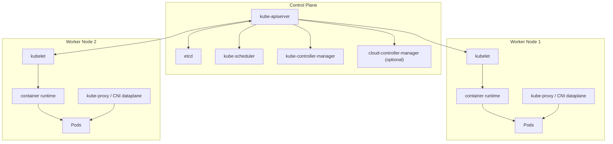
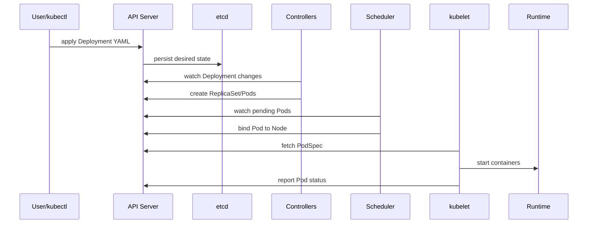

# Kubernetes Architecture

## Overview

Kubernetes architecture is designed around a clear separation of responsibilities:

- **Control Plane**: makes decisions and manages desired state
- **Worker Nodes**: run application workloads (Pods)

This separation allows Kubernetes to scale, self-heal, and operate reliably in distributed environments.

In simple terms:

- control plane is the brain
- worker nodes are the execution layer

---

## High-Level Cluster Architecture



---

## Control Plane Components

### 1. kube-apiserver

The API server is the front door of Kubernetes.

Responsibilities:

- receives requests from `kubectl`, controllers, and operators
- validates and authorizes requests
- persists cluster objects to etcd
- exposes REST API for all cluster operations

Every operation in Kubernetes flows through API server.

---

### 2. etcd

`etcd` is a distributed key-value store and the source of truth for cluster state.

Stores:

- Pod specs
- Deployments, Services, ConfigMaps, Secrets
- Node information
- namespace and RBAC data

Important note:

- if etcd is unavailable, control plane cannot reliably read/write state
- etcd backup strategy is critical in production

---

### 3. kube-scheduler

The scheduler assigns unscheduled Pods to suitable worker nodes.

It considers:

- CPU and memory availability
- node taints and Pod tolerations
- node selectors and affinity/anti-affinity
- topology spread constraints
- custom scheduling policies

The scheduler chooses a node; kubelet on that node starts the Pod.

---

### 4. kube-controller-manager

This component runs multiple reconciliation controllers.

Examples:

- Deployment controller
- ReplicaSet controller
- Node controller
- Job/CronJob controller
- Namespace controller

Controller logic:

1. watch actual state from API server
2. compare with desired state
3. perform actions to reconcile difference

---

### 5. cloud-controller-manager (optional)

Used in cloud environments to integrate with cloud APIs.

Typical responsibilities:

- node lifecycle from cloud instances
- load balancer provisioning for Service type LoadBalancer
- route and volume integrations

Not always used in local/self-managed bare-metal clusters.

---

## Worker Node Components

### 1. kubelet

Agent running on each worker node.

Responsibilities:

- watches PodSpecs assigned to its node
- asks container runtime to create/start/stop containers
- runs probes and reports status back to API server

kubelet ensures node-level desired state is maintained.

---

### 2. Container Runtime

Software that actually runs containers.

Common runtimes:

- containerd
- CRI-O

Kubernetes communicates via CRI (Container Runtime Interface).

---

### 3. kube-proxy (or eBPF-based dataplane)

Implements Service networking and load-balancing rules.

Responsibilities:

- routes traffic from Service virtual IPs to Pod endpoints
- manages node-level network forwarding rules
- supports cluster internal service communication

In modern setups, CNI/eBPF implementations may replace traditional kube-proxy behavior.

---

### 4. Pods

Pods are the smallest deployable units running one or more containers.

Worker nodes host Pods and enforce runtime constraints.

---

## Architecture Flow: From YAML to Running Pods

When you apply a Deployment manifest, this is what happens:

1. `kubectl apply -f deployment.yaml` sends request to API server
2. API server validates and stores object in etcd
3. Deployment controller observes desired replicas
4. ReplicaSet is created/updated
5. Scheduler picks nodes for unscheduled Pods
6. kubelet on target nodes starts containers via runtime
7. Service (if defined) routes traffic to ready Pods



---

## Control Plane HA (High Availability)

Production clusters often run multiple control plane nodes.

Typical HA design:

- multiple API server instances
- highly available etcd cluster (odd members, commonly 3 or 5)
- scheduler/controller-manager running active leader election

Benefits:

- avoids single point of failure
- supports upgrades and maintenance with reduced downtime

---

## Networking Architecture Basics

Kubernetes networking follows these principles:

- every Pod gets its own IP
- Pods can reach other Pods without NAT (within cluster network)
- Services provide stable virtual endpoints
- DNS (CoreDNS) enables name-based service discovery

Common networking layers:

- CNI plugin for Pod networking
- Service routing layer (kube-proxy/eBPF)
- Ingress/Gateway for north-south HTTP traffic

---

## Storage Architecture Basics

Kubernetes separates compute from storage using abstractions:

- **Volume**: Pod-level mount
- **PersistentVolume (PV)**: cluster storage resource
- **PersistentVolumeClaim (PVC)**: request for storage
- **StorageClass**: dynamic provisioning policy

This architecture allows stateless and stateful workloads to run with proper data lifecycle control.

---

## Security Architecture Basics

Key architectural security layers:

- API authentication and authorization (RBAC)
- namespace-based logical isolation
- network policies for traffic control
- secrets management for sensitive data
- admission controllers and policy enforcement

Security in Kubernetes is layered, not a single feature.

---

## Common Architecture Patterns

### 1. Single Control Plane (Learning/Lab)

- simple setup
- not fault tolerant

### 2. Highly Available Control Plane (Production)

- multiple control plane nodes
- resilient etcd
- external load balancer for API server endpoint

### 3. Managed Kubernetes (EKS/AKS/GKE)

- provider manages most control plane complexity
- teams focus on workloads and policies

---

## Useful Commands for Architecture Visibility

```bash
# Cluster info and API endpoints
kubectl cluster-info

# Node details
kubectl get nodes -o wide
kubectl describe node <node-name>

# Control plane and system pods
kubectl get pods -n kube-system

# View component health proxies (availability depends on setup)
kubectl get --raw='/readyz?verbose'

# View all resources in a namespace
kubectl get all -n default
```

---

## Common Issues and Troubleshooting by Layer

### 1. API Server Unreachable

Symptoms:

- `kubectl` commands time out
- cannot create/update objects

Checks:

- API server endpoint health
- network path to control plane
- cluster credentials/context

### 2. Pods Pending (Scheduling Layer)

Symptoms:

- Pods not assigned to nodes

Checks:

```bash
kubectl describe pod <pod-name>
kubectl get events --sort-by=.metadata.creationTimestamp
```

Likely causes:

- insufficient CPU/memory
- strict affinity/anti-affinity
- taints without tolerations

### 3. Service Reachability Issues (Network Layer)

Symptoms:

- Service exists but requests fail

Checks:

```bash
kubectl get svc
kubectl get endpoints <service-name>
kubectl describe svc <service-name>
```

Likely causes:

- label selector mismatch
- CNI dataplane problems
- network policy blocking traffic

---

## Interview Questions

### 1. What are the two major parts of Kubernetes architecture?

**Answer:**
Control plane and worker nodes. Control plane manages state and decisions; worker nodes run Pods.

---

### 2. Why is etcd critical in Kubernetes?

**Answer:**
etcd stores the cluster's source-of-truth state. If etcd is unavailable or corrupted, control plane operations and cluster consistency are impacted.

---

### 3. What is the role of kubelet?

**Answer:**
kubelet is the node agent that ensures assigned Pods are running correctly by interacting with the container runtime and reporting status to API server.

---

### 4. How does scheduling happen in Kubernetes?

**Answer:**
Scheduler watches unscheduled Pods, evaluates candidate nodes based on constraints/resources, and binds each Pod to a selected node.

---

## Summary

* Kubernetes architecture separates management (control plane) from execution (worker nodes)

* API server, etcd, scheduler, and controllers drive desired-state reconciliation

* kubelet, container runtime, and network dataplane run and connect workloads on nodes

* High availability, networking design, storage model, and security layers are all core architecture decisions

* Understanding architecture deeply helps in troubleshooting, scaling, and production readiness

A strong architecture foundation makes all higher-level Kubernetes topics easier: Deployments, Services, Ingress, StatefulSets, and platform operations.

---