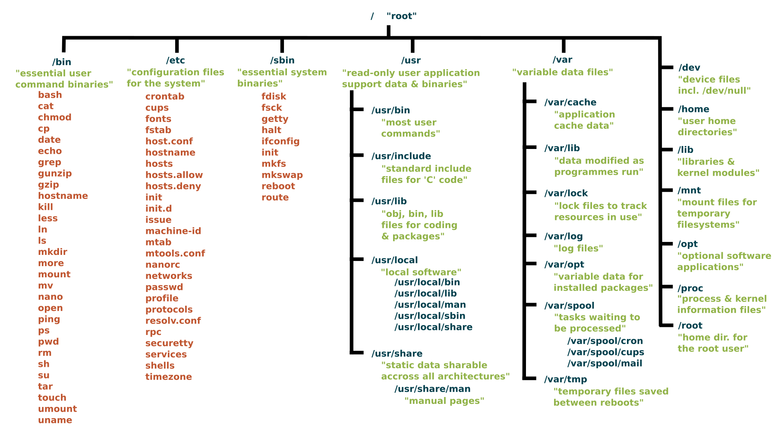

# Introduction to Linux File Systems

## Overview

A **file system** defines how data is stored, organized, and retrieved on storage devices.

In Linux, everything is treated as a file — including:

* regular files
* directories
* devices
* processes
* sockets

Understanding Linux file systems is essential for:

* server administration
* storage management
* log inspection
* performance tuning
* DevOps and cloud engineering

---

## What Is a File System?

A file system is responsible for:

* Organizing data into directories
* Managing file metadata (size, permissions, timestamps)
* Tracking free and used disk space
* Ensuring data integrity

Without a file system, raw disk blocks would be unusable.

---

## The Linux File System Structure

Linux follows the **File System Hierarchy Standard (FHS)**.

All files and directories originate from a single root:

```
/
```

Unlike Windows (`C:\`, `D:\`), Linux uses a **unified directory tree**.

---

## High-Level File System Structure



### Root Directory `/`

The root (`/`) is the top-level directory.

Every other directory is a subdirectory of `/`.

Example:

```
/home
/var
/etc
/usr
```

---

## Core Directories in Linux

### `/bin` – Essential User Binaries

Contains basic command-line tools required for system operation.

Examples:

* `ls`
* `cp`
* `mv`
* `cat`

These are needed even in single-user mode.

---

### `/sbin` – System Binaries

Contains administrative commands.

Examples:

* `reboot`
* `fsck`
* `mount`

Typically used by root.

---

### `/etc` – Configuration Files

Stores system-wide configuration files.

Examples:

* `/etc/passwd`
* `/etc/ssh/sshd_config`
* `/etc/nginx/nginx.conf`

If a server behaves unexpectedly, `/etc` is often inspected first.

---

### `/home` – User Home Directories

Each user gets a personal directory.

Example:

```
/home/ben
/home/admin
```

Stores personal files, SSH keys, shell configs, etc.

---

### `/root` – Root User Home

Home directory for the root user.

Different from `/`.

---

### `/var` – Variable Data

Stores data that frequently changes.

Examples:

* logs → `/var/log`
* web content → `/var/www`
* spool files → `/var/spool`

Backend engineers frequently inspect `/var/log` during debugging.

---

### `/usr` – User Programs & Libraries

Contains installed applications and libraries.

Subdirectories:

* `/usr/bin`
* `/usr/lib`
* `/usr/share`

Most installed software resides here.

---

### `/tmp` – Temporary Files

Used for temporary storage.

* Often cleared on reboot
* Accessible by all users

Be cautious storing critical data here.

---

### `/dev` – Device Files

Linux treats hardware as files.

Examples:

* `/dev/sda` (disk)
* `/dev/null`
* `/dev/tty`

This reflects the Unix philosophy: **everything is a file**.

---

### `/proc` – Process Information (Virtual File System)

A virtual filesystem providing runtime system information.

Examples:

* `/proc/cpuinfo`
* `/proc/meminfo`
* `/proc/<pid>/`

Used heavily for monitoring and debugging.

---

### `/sys` – System Information

Provides information about devices and kernel state.

Also virtual — not physically stored on disk.

---

## Types of Linux File Systems

Linux supports multiple file system types.

### 1. EXT4

ext4

Most common Linux file system.

Features:

* journaling
* large file support
* stability

Default for many distributions.

---

### 2. XFS

XFS

High-performance journaling file system.

Used in enterprise systems and large storage servers.

---

### 3. Btrfs

Btrfs

Modern file system with advanced features:

* snapshots
* compression
* built-in RAID

Used in advanced setups.

---

### 4. FAT32 / NTFS

Used for compatibility with Windows systems.

Linux can mount these but they are not native Linux file systems.

---

## Physical vs Virtual File Systems

| Type     | Example         | Stored on Disk? |
| -------- | --------------- | --------------- |
| Physical | `/home`, `/var` | Yes             |
| Virtual  | `/proc`, `/sys` | No              |

Virtual file systems are dynamically generated by the kernel.

---

## How Storage Is Mounted in Linux

Linux does not use drive letters.

Instead, storage devices are mounted into the directory tree.

Example:

```
/dev/sdb1 → mounted at /mnt/data
```

This means:

* The device becomes accessible at `/mnt/data`
* It integrates into the main file tree

Check mounts using:

```bash
lsblk
mount
df -h
```

---

## Why File System Knowledge Is Critical for Backend Engineers

You’ll need to:

* analyze logs in `/var/log`
* debug services via `/etc`
* monitor memory via `/proc`
* manage disk space
* configure storage volumes in cloud systems
* mount Docker volumes properly

Without understanding file system structure, production debugging becomes difficult.

---

## Interview Questions

### 1. What is the root directory in Linux?

**Answer:**
The root directory (`/`) is the top-level directory from which all other directories branch.

---

### 2. What is the purpose of `/etc`?

**Answer:**
It stores system-wide configuration files.

---

### 3. What is `/proc`?

**Answer:**
A virtual file system that provides runtime system and process information.

---

### 4. What is ext4?

**Answer:**
ext4 is a widely used Linux journaling file system that supports large files and stability.

---

### 5. What does mounting mean in Linux?

**Answer:**
Mounting attaches a storage device to a directory in the file system hierarchy.

---

## Summary

* Linux uses a **single unified directory tree** starting at `/`

* The structure follows the **File System Hierarchy Standard (FHS)**

* Key directories include `/etc`, `/home`, `/var`, `/usr`, `/proc`

* Linux supports multiple file system types like ext4, XFS, and Btrfs

* Storage devices are mounted into the directory tree

* File system mastery is essential for backend and DevOps engineers

---
